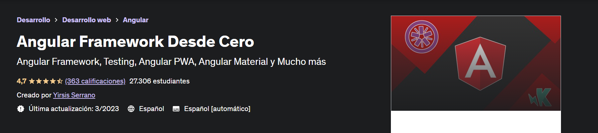

# Curso Angular Framework Desde Cero

Este curso esta diseñado para ser capaz de entender angular y tener la capacidad de integrar conceptos y tecnologías como:

-Testing

-Angular Material

-Frameworks CSS

-SASS

-Rutas

-MEAN Stack

Especialmente este curso esta pensado en seguir buenas practicas y seguirá agregando contenido, ya que el propósito es que este actualizado siempre.

De igual manera, hay temas que pronto serán cubiertos y estarán disponibles poco a poco.

Este curso trata de ser único en la materia, ya que intento cubrir temas que en algunas ocasiones es algo complicado aprender o encontrar información al respecto en español y esa también es una de sus metas, ser un curso muy completo en la materia y que este en este idioma.

Este curso contiene múltiples proyectos con la finalidad de crear experiencia que puedas utilizar en un futuro.

### Última actualización: 3/2023

## Contenido del curso

-   Introducción
-   Angular - Primeros pasos
-   Fundamentos de Angular
-   Testing de Componentes
-   Despliegues y Estilos
-   PWA - Aplicación Web Progresiva
-   Directiva NgFor y Bulma CSS
-   Servicios
-   Directiva NgIf y NgClass
-   Test de Servicios
-   Servicios HTTP y Angular Material
-   Testing de Servicios HTTP
-   Pipes de Angular
-   Custom Pipes
-   Testing de Pipes
-   BONUS: RxJS
-   Directivas
-   Testing de Directivas
-   Formularios por Template
-   Formularios Reactivos
-   Testing de Formularios
-   Sass - Preprocesador CSS
-   Rutas - Aplicaciones SPA
-   Angular Universal
-   MEAN Stack - Auth API
-   MEAN Stack - CRUD API
-   MEAN Stack - Auth Angular
-   MEAN Stack - CRUD Angular
-   Desplegar Aplicación FullStack
-   Documentación de API's con Swagger
-   Fin Temporal

